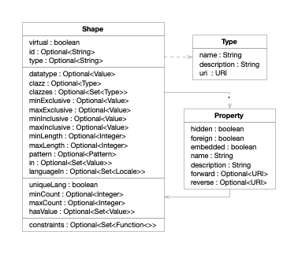

This reference provides a comprehensive overview of all shape constructors and methods available in Metreeca/Mesh for
defining data structures and validation constraints.

Metreeca/Mesh shapes are built upon established W3C standards: [JSON-LD](https://www.w3.org/TR/json-ld/) for linked data
serialisation and [SHACL](https://www.w3.org/TR/shacl/) for validation constraints. The framework provides a fluent Java
API that generates both JSON-LD context definitions and SHACL constraint graphs, enabling seamless integration with the
broader semantic web ecosystem whilst maintaining developer productivity through familiar programming patterns.

# Shape Constraints

Constraints that validate and restrict shape values including identity, datatypes, and ranges.

| Factory                                                                                                             | Description                                |
|---------------------------------------------------------------------------------------------------------------------|--------------------------------------------|
| [`Shape.shape()`](https://javadoc.io/doc/com.metreeca/mesh-core/latest/com/metreeca/mesh/shapes/Shape.html#shape()) | Creates an empty shape with no constraints |

## Identity and Metadata

Configure resource identity properties and type classification for RDF serialisation.

| Method                                                                                                                            | Description                                                                  |
|-----------------------------------------------------------------------------------------------------------------------------------|------------------------------------------------------------------------------|
| [`virtual(boolean)`](https://javadoc.io/doc/com.metreeca/mesh-core/latest/com/metreeca/mesh/shapes/Shape.html#virtual(boolean))   | Marks the shape as virtual, generated on the fly during retrieval operations |
| [`id(String)`](https://javadoc.io/doc/com.metreeca/mesh-core/latest/com/metreeca/mesh/shapes/Shape.html#id(java.lang.String))     | Designates the property that supplies the `@id` value for JSON-LD context    |
| [`type(String)`](https://javadoc.io/doc/com.metreeca/mesh-core/latest/com/metreeca/mesh/shapes/Shape.html#type(java.lang.String)) | Designates the property that supplies the `@type` value for JSON-LD context  |

## Datatype Constraints

Restrict values to specific RDF datatypes like strings, integers, dates, and URIs.

| Method                                                                                                                                          | Description                                                                                                                                                                                                                                                                                                                                                                                                                                                                                        |
|-------------------------------------------------------------------------------------------------------------------------------------------------|----------------------------------------------------------------------------------------------------------------------------------------------------------------------------------------------------------------------------------------------------------------------------------------------------------------------------------------------------------------------------------------------------------------------------------------------------------------------------------------------------|
| [`datatype(Value)`](https://javadoc.io/doc/com.metreeca/mesh-core/latest/com/metreeca/mesh/shapes/Shape.html#datatype(com.metreeca.mesh.Value)) | Each value in the focus set has the specified RDF datatype like [`boolean`](https://javadoc.io/doc/com.metreeca/mesh-core/latest/com/metreeca/mesh/Value.html#Bit()), [`string`](https://javadoc.io/doc/com.metreeca/mesh-core/latest/com/metreeca/mesh/Value.html#String()), [`integer`](https://javadoc.io/doc/com.metreeca/mesh-core/latest/com/metreeca/mesh/Value.html#Integer()), [`date`](https://javadoc.io/doc/com.metreeca/mesh-core/latest/com/metreeca/mesh/Value.html#LocalDate()), … |

## Class Constraints

Require resource instances to belong to specific RDF classes. Values must be instances of all specified types (explicit
and implicit). The explicit type populates the `@type` property for disambiguation.

| Method                                                                                                                                                   | Description                                                                                                           |
|----------------------------------------------------------------------------------------------------------------------------------------------------------|-----------------------------------------------------------------------------------------------------------------------|
| [`clazz(Type, Type...)`](https://javadoc.io/doc/com.metreeca/mesh-core/latest/com/metreeca/mesh/shapes/Type,com.metreeca.mesh.shapes.Type...))           | Each value in the focus set is an instance of all specified RDF class types; explicit type populates `@type` property |
| [`clazzes(Type...)`](https://javadoc.io/doc/com.metreeca/mesh-core/latest/com/metreeca/mesh/shapes/Shape.html#clazzes(com.metreeca.mesh.shapes.Type...)) | Each value in the focus set is an instance of all specified RDF class types; no explicit type for `@type` property    |

## Value Range Constraints

Set numeric or lexicographic bounds on values using XSD comparison operators.

| Method                                                                                                                                                  | Description                                                                                                        |
|---------------------------------------------------------------------------------------------------------------------------------------------------------|--------------------------------------------------------------------------------------------------------------------|
| [`minExclusive(Value)`](https://javadoc.io/doc/com.metreeca/mesh-core/latest/com/metreeca/mesh/shapes/Shape.html#minExclusive(com.metreeca.mesh.Value)) | Each value in the focus set is strictly greater than the specified limit, according to XSD comparison operators    |
| [`maxExclusive(Value)`](https://javadoc.io/doc/com.metreeca/mesh-core/latest/com/metreeca/mesh/shapes/Shape.html#maxExclusive(com.metreeca.mesh.Value)) | Each value in the focus set is strictly less than the specified limit, according to XSD comparison operators       |
| [`minInclusive(Value)`](https://javadoc.io/doc/com.metreeca/mesh-core/latest/com/metreeca/mesh/shapes/Shape.html#minInclusive(com.metreeca.mesh.Value)) | Each value in the focus set is greater than or equal to the specified limit, according to XSD comparison operators |
| [`maxInclusive(Value)`](https://javadoc.io/doc/com.metreeca/mesh-core/latest/com/metreeca/mesh/shapes/Shape.html#maxInclusive(com.metreeca.mesh.Value)) | Each value in the focus set is less than or equal to the specified limit, according to XSD comparison operators    |

## Text Constraints

Validate string length constraints and regular expression pattern matching rules.

| Method                                                                                                                                  | Description                                                                                                               |
|-----------------------------------------------------------------------------------------------------------------------------------------|---------------------------------------------------------------------------------------------------------------------------|
| [`minLength(int)`](https://javadoc.io/doc/com.metreeca/mesh-core/latest/com/metreeca/mesh/shapes/Shape.html#minLength(int))             | The length of the lexical representation of each value in the focus set is greater than or equal to the specified minimum |
| [`maxLength(int)`](https://javadoc.io/doc/com.metreeca/mesh-core/latest/com/metreeca/mesh/shapes/Shape.html#maxLength(int))             | The length of the lexical representation of each value in the focus set is less than or equal to the specified maximum    |
| [`pattern(String)`](https://javadoc.io/doc/com.metreeca/mesh-core/latest/com/metreeca/mesh/shapes/Shape.html#pattern(java.lang.String)) | The lexical representation of each value in the focus set matches the specified Java regular expression pattern           |

## Value Enumeration Constraints

Limit values to predefined sets with exact matching requirements.

| Method                                                                                                                                    | Description                                                                   |
|-------------------------------------------------------------------------------------------------------------------------------------------|-------------------------------------------------------------------------------|
| [`in(Value...)`](https://javadoc.io/doc/com.metreeca/mesh-core/latest/com/metreeca/mesh/shapes/Shape.html#in(com.metreeca.mesh.Value...)) | Each value in the focus set is included in the specified set of target values |

## Language Constraints

Control language tags on literal values and enforce uniqueness requirements.

| Method                                                                                                                                              | Description                                                                                            |
|-----------------------------------------------------------------------------------------------------------------------------------------------------|--------------------------------------------------------------------------------------------------------|
| [`languageIn(Locale...)`](https://javadoc.io/doc/com.metreeca/mesh-core/latest/com/metreeca/mesh/shapes/Shape.html#languageIn(java.util.Locale...)) | Each value in the focus set is a tagged literal with a language tag derived from the specified locales |
| [`uniqueLang(boolean)`](https://javadoc.io/doc/com.metreeca/mesh-core/latest/com/metreeca/mesh/shapes/Shape.html#uniqueLang(boolean))               | The focus set contains at most one tagged literal value for each language tag                          |

## Cardinality Constraints

Control how many values are allowed or required in the focus set.

| Method                                                                                                                    | Description                                                                       |
|---------------------------------------------------------------------------------------------------------------------------|-----------------------------------------------------------------------------------|
| [`minCount(int)`](https://javadoc.io/doc/com.metreeca/mesh-core/latest/com/metreeca/mesh/shapes/Shape.html#minCount(int)) | The size of the focus set is greater than or equal to the specified minimum value |
| [`maxCount(int)`](https://javadoc.io/doc/com.metreeca/mesh-core/latest/com/metreeca/mesh/shapes/Shape.html#maxCount(int)) | The size of the focus set is less than or equal to the specified maximum value    |

## Cardinality Shorthands

Common cardinality patterns provided as convenience methods for [
`minCount(int)`](https://javadoc.io/doc/com.metreeca/mesh-core/latest/com/metreeca/mesh/shapes/Shape.html#minCount(int))
and [
`maxCount(int)`](https://javadoc.io/doc/com.metreeca/mesh-core/latest/com/metreeca/mesh/shapes/Shape.html#maxCount(int))
combinations.

| Method                                                                                                                  | Description                                                                                 |
|-------------------------------------------------------------------------------------------------------------------------|---------------------------------------------------------------------------------------------|
| [`multiple()`](https://javadoc.io/doc/com.metreeca/mesh-core/latest/com/metreeca/mesh/shapes/Shape.html#multiple())     | Sets cardinality to [0..*] allowing any number of values including zero (unlimited)         |
| [`repeatable()`](https://javadoc.io/doc/com.metreeca/mesh-core/latest/com/metreeca/mesh/shapes/Shape.html#repeatable()) | Sets cardinality to [1..*] requiring at least one value but allowing multiple values        |
| [`optional()`](https://javadoc.io/doc/com.metreeca/mesh-core/latest/com/metreeca/mesh/shapes/Shape.html#optional())     | Sets cardinality to [0..1] allowing zero or one value but preventing multiple values        |
| [`required()`](https://javadoc.io/doc/com.metreeca/mesh-core/latest/com/metreeca/mesh/shapes/Shape.html#required())     | Sets cardinality to [1..1] requiring one and only one value to be present                   |
| [`exactly(int)`](https://javadoc.io/doc/com.metreeca/mesh-core/latest/com/metreeca/mesh/shapes/Shape.html#exactly(int)) | Sets cardinality to [n..n] requiring precisely the specified number of values to be present |

## Required Values

Specify mandatory values that must be present in the focus set.

| Method                                                                                                                                                | Description                                                               |
|-------------------------------------------------------------------------------------------------------------------------------------------------------|---------------------------------------------------------------------------|
| [`hasValue(Value...)`](https://javadoc.io/doc/com.metreeca/mesh-core/latest/com/metreeca/mesh/shapes/Shape.html#hasValue(com.metreeca.mesh.Value...)) | The focus set includes all values from the specified set of target values |

## Custom Constraints

Apply custom validation logic through functions for complex business rules.

| Method                                                                                                                                                                           | Description                                                                                                                                                                                   |
|----------------------------------------------------------------------------------------------------------------------------------------------------------------------------------|-----------------------------------------------------------------------------------------------------------------------------------------------------------------------------------------------|
| [`constraints(Function<Value, Value>...)`](https://javadoc.io/doc/com.metreeca/mesh-core/latest/com/metreeca/mesh/shapes/Shape.html#constraints(java.util.function.Function...)) | Applies custom validation functions that take a value as argument and return a trace value detailing constraint violations; empty trace values indicate successful validation and are ignored |

## Property Management

Define structural properties that specify resource relationships and constraints.

| Method                                                                                                                                                                 | Description                                                                         |
|------------------------------------------------------------------------------------------------------------------------------------------------------------------------|-------------------------------------------------------------------------------------|
| [`property(Property)`](https://javadoc.io/doc/com.metreeca/mesh-core/latest/com/metreeca/mesh/shapes/Shape.html#property(com.metreeca.mesh.shapes.Property))           | Adds a single property definition with its constraints to the shape's structure     |
| [`properties(Property...)`](https://javadoc.io/doc/com.metreeca/mesh-core/latest/com/metreeca/mesh/shapes/Shape.html#properties(com.metreeca.mesh.shapes.Property...)) | Defines the complete set of properties that form the shape's structural constraints |

## Shape Composition

Combine multiple shapes using inheritance and composition patterns.

| Method                                                                                                                                             | Description                                                                                     |
|----------------------------------------------------------------------------------------------------------------------------------------------------|-------------------------------------------------------------------------------------------------|
| [`extend(Shape)`](https://javadoc.io/doc/com.metreeca/mesh-core/latest/com/metreeca/mesh/shapes/Shape.html#extend(com.metreeca.mesh.shapes.Shape)) | Inherits constraints while preserving this shape's explicit class for inheritance scenarios     |
| [`merge(Shape)`](https://javadoc.io/doc/com.metreeca/mesh-core/latest/com/metreeca/mesh/shapes/Shape.html#merge(com.metreeca.mesh.shapes.Shape))   | Combines all constraints including explicit classes, requiring compatible types for composition |

# Type Constraints

Define RDF class types with semantic web URIs and display names.

| Factory                                                                                                                                                          | Description                                               |
|------------------------------------------------------------------------------------------------------------------------------------------------------------------|-----------------------------------------------------------|
| [`Type.type(String name)`](https://javadoc.io/doc/com.metreeca/mesh-core/latest/com/metreeca/mesh/shapes/Type.html#type(java.lang.String))                       | Creates an RDF class type with the specified name         |
| [`Type.type(URI uri)`](https://javadoc.io/doc/com.metreeca/mesh-core/latest/com/metreeca/mesh/shapes/Type.html#type(java.net.URI))                               | Creates an RDF class type from the specified URI          |
| [`Type.type(String name, URI uri)`](https://javadoc.io/doc/com.metreeca/mesh-core/latest/com/metreeca/mesh/shapes/Type.html#type(java.lang.String,java.net.URI)) | Creates an RDF class type with the specified name and URI |

| Method                                                                                                                                         | Description                         |
|------------------------------------------------------------------------------------------------------------------------------------------------|-------------------------------------|
| [`name(String)`](https://javadoc.io/doc/com.metreeca/mesh-core/latest/com/metreeca/mesh/shapes/Type.html#name(java.lang.String))               | Sets the display name for the type  |
| [`description(String)`](https://javadoc.io/doc/com.metreeca/mesh-core/latest/com/metreeca/mesh/shapes/Type.html#description(java.lang.String)) | Sets the description for the type   |
| [`uri(URI)`](https://javadoc.io/doc/com.metreeca/mesh-core/latest/com/metreeca/mesh/shapes/Type.html#uri(java.net.URI))                        | Sets the RDF class URI for the type |

# Property Constraints

Control property behaviour, RDF relationships, and JSON-LD serialisation.

| Factory                                                                                                                                                    | Description                                |
|------------------------------------------------------------------------------------------------------------------------------------------------------------|--------------------------------------------|
| [`Property.property(String name)`](https://javadoc.io/doc/com.metreeca/mesh-core/latest/com/metreeca/mesh/shapes/Property.html#property(java.lang.String)) | Creates a property with the specified name |

| Method                                                                                                                                                     | Description                                                                                       |
|------------------------------------------------------------------------------------------------------------------------------------------------------------|---------------------------------------------------------------------------------------------------|
| [`hidden(boolean)`](https://javadoc.io/doc/com.metreeca/mesh-core/latest/com/metreeca/mesh/shapes/Property.html#hidden(boolean))                           | Excludes the property from default JSON-LD serialisation when true                                |
| [`foreign(boolean)`](https://javadoc.io/doc/com.metreeca/mesh-core/latest/com/metreeca/mesh/shapes/Property.html#foreign(boolean))                         | Marks the property as managed by the linked resource                                              |
| [`embedded(boolean)`](https://javadoc.io/doc/com.metreeca/mesh-core/latest/com/metreeca/mesh/shapes/Property.html#embedded(boolean))                       | Enables cascade updates during resource operations                                                |
| [`name(String)`](https://javadoc.io/doc/com.metreeca/mesh-core/latest/com/metreeca/mesh/shapes/Property.html#name(java.lang.String))                       | Sets the display name for the property                                                            |
| [`description(String)`](https://javadoc.io/doc/com.metreeca/mesh-core/latest/com/metreeca/mesh/shapes/Property.html#description(java.lang.String))         | Sets the description for the property                                                             |
| [`forward(boolean)`](https://javadoc.io/doc/com.metreeca/mesh-core/latest/com/metreeca/mesh/shapes/Property.html#forward(boolean))                         | Enables forward predicate automatically derived from property name for outgoing RDF relationships |
| [`forward(URI)`](https://javadoc.io/doc/com.metreeca/mesh-core/latest/com/metreeca/mesh/shapes/Property.html#forward(java.net.URI))                        | Sets the explicit forward predicate URI for outgoing relationships                                |
| [`reverse(boolean)`](https://javadoc.io/doc/com.metreeca/mesh-core/latest/com/metreeca/mesh/shapes/Property.html#reverse(boolean))                         | Enables reverse predicate automatically derived from property name for incoming RDF relationships |
| [`reverse(URI)`](https://javadoc.io/doc/com.metreeca/mesh-core/latest/com/metreeca/mesh/shapes/Property.html#reverse(java.net.URI))                        | Sets the explicit reverse predicate URI for incoming relationships                                |
| [`shape(Shape)`](https://javadoc.io/doc/com.metreeca/mesh-core/latest/com/metreeca/mesh/shapes/Property.html#shape(com.metreeca.mesh.shapes.Shape))        | Sets the validation constraints for property values                                               |
| [`shape(Supplier<Shape>)`](https://javadoc.io/doc/com.metreeca/mesh-core/latest/com/metreeca/mesh/shapes/Property.html#shape(java.util.function.Supplier)) | Sets the validation constraints using a lazy supplier                                             |
