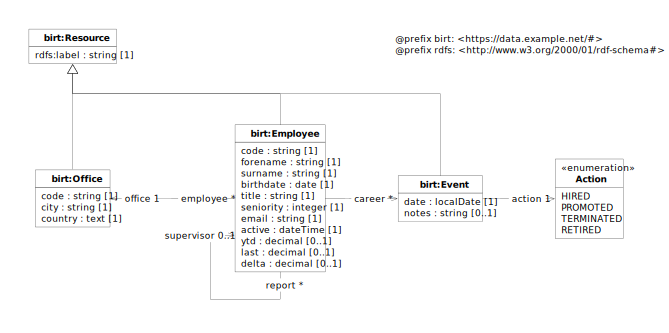

In this tutorial you will learn how to use shapes to define declarative data models that will drive data validation and
other linked data processing tools.

In the process we will focus on the *Office* and *Employees* data tables of the BIRT sample dataset, starting from the
following high‑level UML model (see also the definition of the  [standard datatypes](../handbooks/datatypes.md)used in
the diagram).

----

- initial shape definitions
  - properties
    - name
    - forward URI
- JSON-LD definitions
  - class
    - id/type
    - virtual
  - property
    - hidden
    - foreign/embedded
    - forward/backward URIs
      - simultaneous use
- SHACL constraints
  - examples for each constraint
    - class
      - clazz/clazzes
    - properties
      - …
  - custom class constraints
  - sample validation
